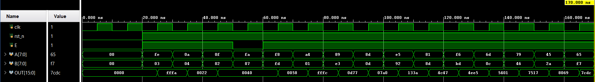
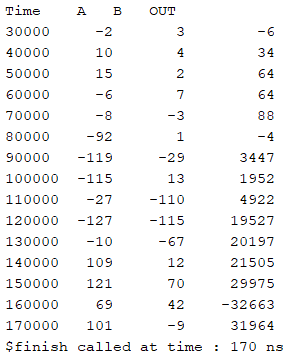

# High-Performance Hybrid MAC Unit

## Overview
This repository implements a **16-bit Multiply-Accumulate (MAC) Unit** designed for high-speed digital signal processing (DSP). This architecture features a **Hybrid Wallace Tree Accumulator**, which integrates the feedback term directly into the partial product reduction stages. This design minimizes the critical path delay compared to traditional architectures that use a separate post-multiplication adder.

### Key Features
* **Radix-8 Booth Encoding:** Reduces the number of partial products to only 3 by grouping bits into triplets.
* **Hybrid Wallace Tree:** Merges the 16-bit accumulator feedback directly into the reduction tree.
* **Signed Arithmetic:** Specifically designed for two's complement signed 8-bit inputs.
* **Optimized Critical Path:** Uses parallel reduction via Carry-Save Addition (CSA) before the final summation.

---

# Architecture

The MAC unit operates through three distinct hardware stages:

### 1. Partial Product Generation (Booth Encoder)
The `booth_encoder` module uses **Radix-8 encoding** to generate partial products representing $\{0, \pm 1M, \pm 2M, \pm 3M, \pm 4M\}$.
* **Hard Multiple Handling:** The module pre-calculates $3M$ (`a_x3`) as $2M + 1M$ to ensure high-speed operation.
* **Output:** The encoder generates a 30-bit bus (`PP`) representing 3 encoded partial products for the 8x8 operation.

### 2. Hybrid Wallace Tree Accumulator
The `hybrid_wallace_tree_acc` module is the core innovation of this IP. It takes the 30-bit partial product bus and the 16-bit accumulator feedback (`A`) as inputs.
* **Stage 1 & 2:** Reduces sign-extension bits and high-order bits of the feedback value.
* **Stage 3:** Compresses all remaining bits into a single Sum and Carry vector.
* **Advantage:** Injecting the feedback into the tree eliminates the extra delay of a standalone 16-bit accumulator adder.

### 3. Final Addition & Storage
* **Ripple Carry Adder (RCA):** A 16-bit RCA performs the final vector summation to produce the product-sum.
* **PIPO Register:** A Parallel-In Parallel-Out register stores the result, controlled by a Clock (`clk`), Enable (`E`), and Reset (`rst_n`).

---

# Module Hierarchy

* `MAC_IP.v`: Top-level wrapper for the MAC system.
* `booth_encoder.v`: Radix-8 encoder and multiplexer logic.
* `hybrid_wallace_tree_acc.v`: The custom reduction tree with integrated feedback.
* `ripple_carry_adder.v`: 16-bit final summation stage.
* `full_adder.v` / `half_adder.v`: Basic arithmetic building blocks.

---

# Performance Specifications

| Parameter | Value |
| :--- | :--- |
| **Multiplier Size** | 8 × 8 Signed |
| **Accumulator Width** | 16-bit |
| **Encoding** | Radix-8 Booth |
| **Reduction Method** | Hybrid Wallace Tree |
| **Final Adder** | 16-bit Ripple Carry |

---

## Simulation Results

### Waveform Analysis
The simulation waveform below demonstrates the MAC operation with various input combinations:

*Figure 1: Simulation waveform showing clock, reset, enable, inputs A/B, and output MAC result*

### Console Output
The simulation console output verifies the correct functionality with multiple test cases:

*Figure 2: Console output showing test cases and computed MAC results*

### Test Cases Performed
| Test Case | A (Input) | B (Input) | Expected Operation | Result |
|-----------|-----------|-----------|-------------------|--------|
| Reset Test | - | - | Clear accumulator | PASS |
| Test 1 | 5 | 3 | 0 + (5×3) = 15 | PASS |
| Test 2 | -4 | 7 | 15 + (-4×7) = -13 | PASS |
| Test 3 | -2 | -6 | -13 + (12) = -1 | PASS |
| Test 4 | 10 | -3 | -1 + (-30) = -31 | PASS |

---

# Simulation & Usage

### 1. Setup
Add all `.v` source files to your project in Vivado, ModelSim, or Quartus.

### 2. Operation
1.  Apply a low pulse to `rst_n` to clear the accumulator to 0.
2.  Set the Enable signal `E` to high.
3.  On every rising edge of `clk`, the unit will compute:  
    $OUT = OUT + (A \times B)$

---

# Author
**Arju Mukherjee** B.Tech Electronics / VLSI Enthusiast  
Specializing in Digital Design and Computer Architecture.

# License
This project is released under the **MIT License**.
